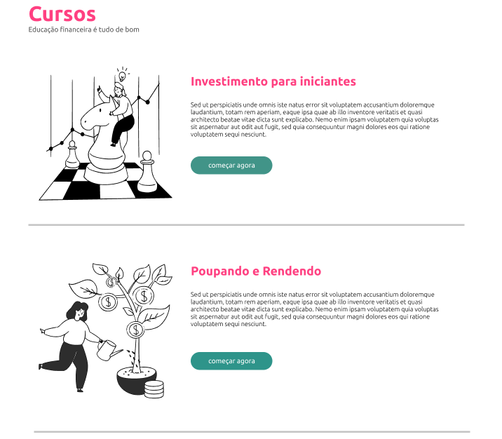
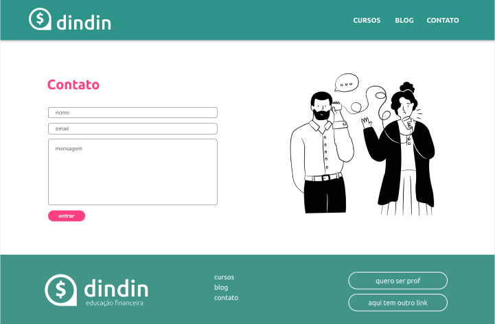

<h1 align="center">Projeto Integrador - Gama Academy</h1>

Projeto integrador, realizado no curso IBRF Tech - Dev Starter em parceria com a Gama Academy.

  <a href="#-tecnologias">Tecnologias</a>&nbsp;&nbsp;&nbsp;|&nbsp;&nbsp;&nbsp;
  <a href="#-projeto">Projeto</a>&nbsp;&nbsp;&nbsp;|&nbsp;&nbsp;&nbsp;
  <a href="#-layout">Layout</a>&nbsp;&nbsp;&nbsp;|&nbsp;&nbsp;&nbsp;
  <a href="#memo-licença">Licença</a>

  

 

  

  

  

## 🚀 Tecnologias

Esse projeto foi desenvolvido com as seguintes tecnologias:

- HTML5
- CSS3
- JavaScript
- Git
- Github

## 💻 Projeto

 #### <i> "A empresa fictícia DINDIN, quer lançar uma plataforma de conteúdo sobre Educação Financeira e você foi contratado/a como pessoa desenvolvedora!" </i>

Construir um site institucional do zero, colocando em prática tudo que aprendemos sobre HTML, CSS, Javascript e Git.

## ✍️ Desafios:

- Desenvolver páginas responsivas que se adaptam para
diferentes tamanho de dispositivos;

- Navegar pelo DOM com Javascript;

- Exibir conteúdos dinâmicos nas páginas do site;

- Utilizar Git para versionar o código do projeto e
gerenciar alterações em equipe;

- Publicar um projeto com o Github Pages.

## 🔖 Layout

- [Acesse aqui o projeto finalizado, online](https://heloisaho28.github.io/Projeto-integradorGAMA/paginaPrincipal.html)

## :memo: Licença

Esse projeto está sob a licença MIT.

---

Feito com ♥ by Grupo 3